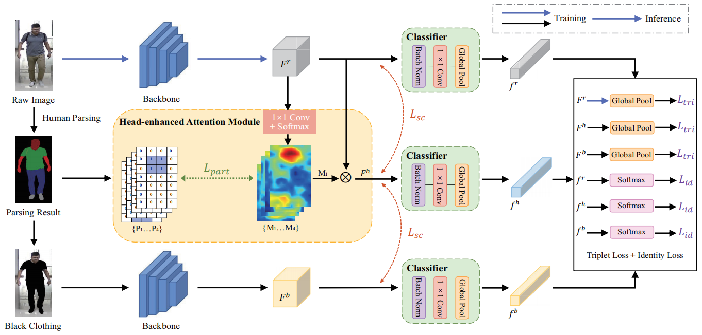

## Semantic-aware Consistency Network for Cloth-changing Person Re-Identification (ACM MM, 2023)
### Overall Framework

### Requirements
- Python 3.6
- Pytorch 1.6.0
- yacs
- apex

### Get Started
- Clone this repo:
  ```bash
  git clone https://github.com/Gpn-star/SCNet.git
  cd SCNet
  ```
- Download datasets: \
  LTCC: [[GoogleDrive]](https://drive.google.com/file/d/1h-MIQvD1H3o4R4351wOAfnOM4ANXJyDR/view?usp=drive_link) \
  PRCC: [[GoogleDrive]](https://drive.google.com/file/d/1SC-FK0VngHcdmwQwJtk8ZREMKXbQPNEi/view?usp=drive_link) \
  Vc-Clothes: [[GoogleDrive]](https://drive.google.com/file/d/1O-aTGJT3PiWaKFQXvNsdkNsAZdnLiy3t/view?usp=drive_link) \
  DeepChange: [[GoogleDrive]](https://drive.google.com/file/d/13H3cBnIhY44S3SNELpnlPI6DA6-t9jmR/view?usp=sharing)
  

- Replace `_C.DATA.ROOT` and `_C.OUTPUT` in `configs/default_img.py`with your own `data root path` and `output path`, respectively.


- Run `script.sh`

### Citation
If you find this code useful for your research, please cite our paper:

```
@inproceedings{guo2023SCNet,
  title={Semantic-aware Consistency Network for Cloth-changing Person Re-Identification},
  author={Guo, Peini and Liu, Hong and Wu, Jianbing and Wang, Guoquan and Wang, Tao},
  booktitle={Proceedings of the 31th ACM International Conference on Multimedia},
  year={2023}
}
```
### Contact Us
If you have any doubt about this code, please send emails to: `guopeini@stu.pku.edu.cn`.

